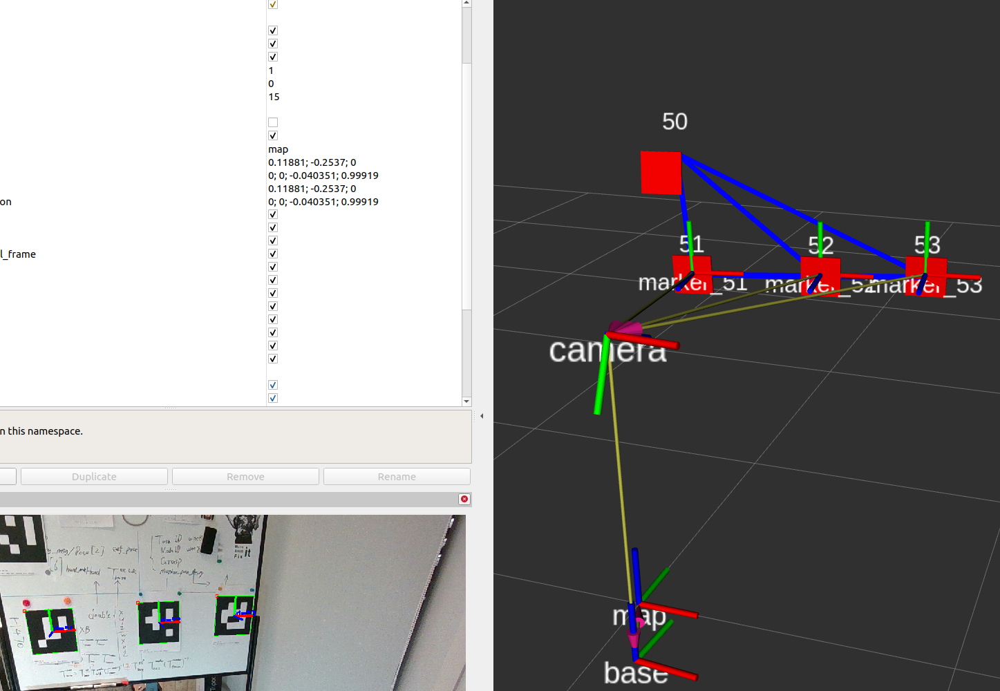

# SLAM based on ArUco markers (fiducials-ROS2)

# Feature

- specify a list  of marker ids that are ignored during ArUco detection.

- set marker size for each marker, so that you can use markers of different size.

- specify markers used as SLAM landmarks. Markers that are not  included in the specified list are ignored in SLAM. So that the ignored markers can be used for other usage, like object location.

# Quickstart

If you have a realsense camera, you can run the following launch file to start marker-based SLAM quickly. Make sure you have realsense-ros2 before quickstart.

```bash
git clone https://github.com/IntelRealSense/realsense-ros.git
```

```bash
ros2 launch marker_slam marker_slam_realsense.launch.xml
```

Open Rviz2, you all see TFs and markers like this:



## Frames in launch parameters

There are a few frames in the SLAM launch parameters:

**{map_frame} **is the frame of your SLAM map.

**{camera_frame} and {base_frame}**: Visual-SLAM actually estimates the pose of camera. The pose of robot {base_frame} is propagated from {camera_frame} through a static TF beween {camera_frame} and {base_frame}. The TF can be obtained by hand-eye calibration for a mobile manipulator.

**{base_frame} and {estimate_frame}**: {estimate_frame} is the robot pose estimated by SLAM. {base_frame} can be used as ground truth if you can somehow obtain the exact location of robot, for example you are running the program in a simulation or you have a better location method. By setting {estimate_frame} and {base_frame} as different name, you can evaluate the performance of this method.

```xml
  <node pkg="marker_slam"  exec="marker_slam"  output="screen" >
    <param name="map_frame"  value="map" />
    <param name="base_frame"  value="base" />
    <param name="camera_frame"  value="$(var camera_frame)" />
    <param name="estimate_frame"  value="base" />
    <param name="verbose"  value="false" />
    <param name="map_file"  value="$(find-pkg-share marker_slam)/launch/map.txt" />
    <param name="landmark"  value="50, 51, 52, 53, 54, 55" value-sep=", " />
  </node>
```

## clean map

Run `sh clean_map.sh` to clean map file. Landmarks will be initiated in next run.


## About camera frame

Only RGB camera is used in ArUco detection. So the reference frame of marker pose estimation is located in the optical center of RGB frame.

For realsense-ros users, please notice that the reference frame is not camera_link_frame.

[IntelRealSense/realsense-ros: Intel(R) RealSense(TM) ROS Wrapper for Depth Camera](https://github.com/IntelRealSense/realsense-ros)

# Change

This project is a ROS2 version of [UbiquityRobotics/fiducials: Simultaneous localization and mapping using fiducial markers.](https://github.com/UbiquityRobotics/fiducials) This project implements most functions of fiducials SLAM with some simplification.

If you come from UbiquityRobotics's fiducials repo, please notice that a few changes are made, compared to fiducials:

1. Only ArUco markers are used, and pose estimation is implemented by default.

2. Most ROS services are removed.

3. The transformation between camera_frame and base_frame are fixed by a tf2_ros static_transform, which is determined during SLAM initialization.
